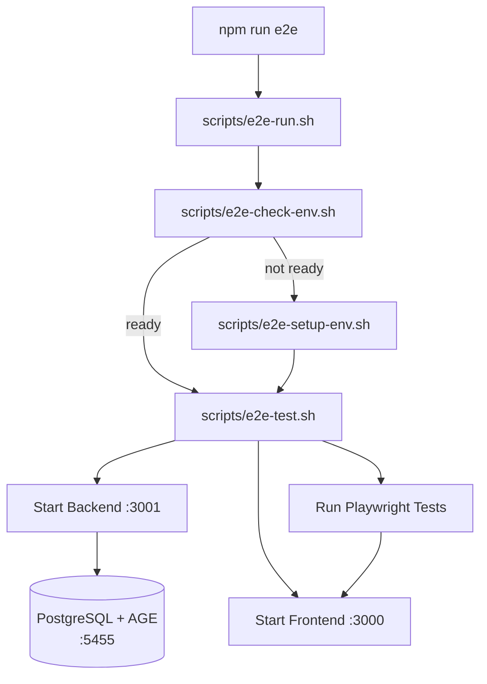
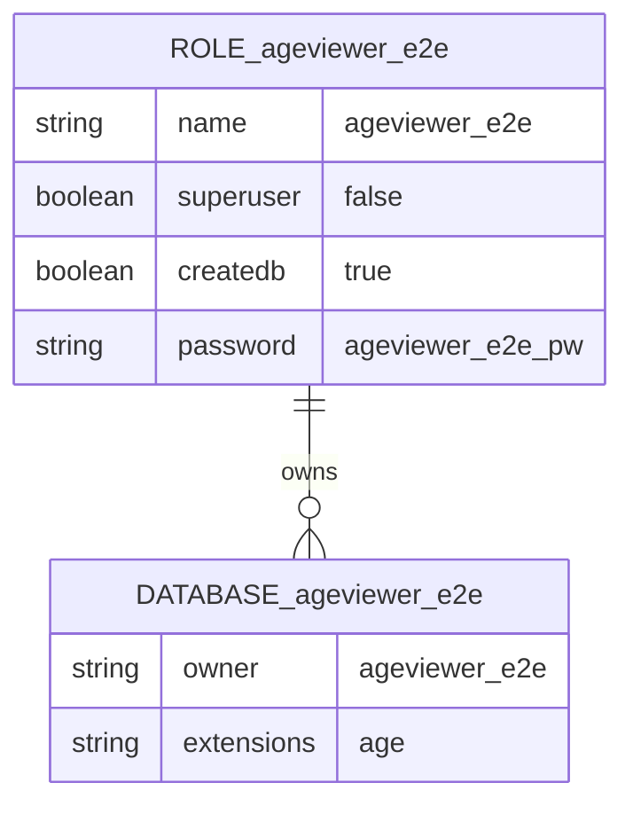
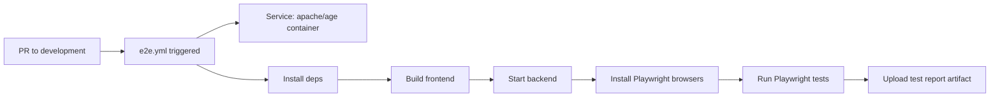

# E2E Test Architecture

## Overview

## Script Responsibilities

### Script 1: `e2e-run.sh` (Orchestrator)
- Entry point for `npm run e2e`
- Calls `e2e-check-env.sh`
- If not ready → calls `e2e-setup-env.sh`
- Then calls `e2e-test.sh`
- Handles cleanup on exit (stop services)

### Script 2: `e2e-check-env.sh` (Environment Validation)
- Checks Docker or Podman is available
- Checks if the test container is running
- Checks if PostgreSQL is accepting connections on port 5455
- Checks if AGE extension is loaded
- Returns exit code: 0 = ready, 1 = not ready

### Script 3: `e2e-setup-env.sh` (Provisioning)
- Detects Docker or Podman
- Pulls `apache/age:latest` image (if not cached)
- Starts container via docker-compose
- Waits for PostgreSQL readiness (`pg_isready`)
- Runs init SQL:
  - Creates test database (`ageviewer_e2e`)
  - Creates test user with RBAC (not superuser)
  - Grants necessary privileges
  - Creates AGE extension
  - Loads `ag_catalog` into search path

### Script 4: `e2e-test.sh` (Test Execution)
- Starts the backend server (background)
- Starts the frontend dev server or serves build (background)
- Waits for both to be ready
- Runs `npx playwright test`
- Captures exit code
- Stops background services
- Returns Playwright's exit code

## Database Configuration

| Setting | Value | Rationale |
|---------|-------|-----------|
| Port | 5455 | Avoids conflict with local PostgreSQL on 5432 |
| User | `ageviewer_e2e` | Dedicated test user, not superuser |
| Password | `ageviewer_e2e_pw` (or `$E2E_DB_PASSWORD`) | From env var in CI |
| Database | `ageviewer_e2e` | Isolated test database |
| Privileges | `CREATE` on DB, `USAGE` on `ag_catalog` | Minimum required for AGE operations |

## CI Workflow

- Separate workflow file: `.github/workflows/e2e.yml`
- Triggered only on PRs to `development`
- Uses GitHub Actions service containers (native Docker support)
- Playwright report uploaded as artifact on failure

## Local vs CI Differences

| Aspect | Local | CI |
|--------|-------|-----|
| Container management | Docker/Podman via scripts | GitHub Actions service container |
| Port | 5455 (mapped) | 5432 (direct, service network) |
| Frontend | Vite dev server (:3000) | Static build served by backend |
| Browser install | Cached after first run | `npx playwright install --with-deps` |
| Cleanup | Script handles stop/remove | Container auto-removed after job |
